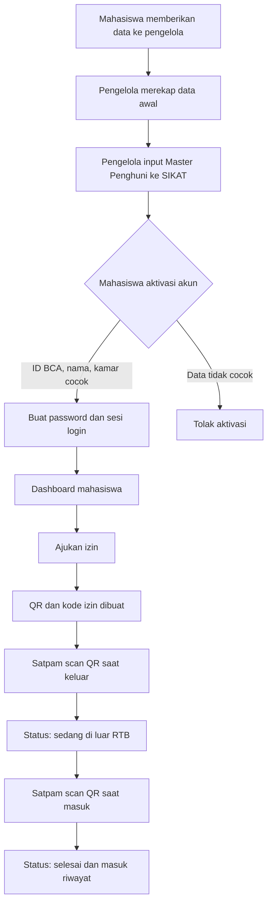

# SIKAT RTB

> Sistem Izin Keluar-Masuk Terintegrasi untuk penghuni Rumah Talenta BCA (RTB).

SIKAT RTB menggantikan pencatatan izin yang tersebar dengan satu alur digital: penghuni mengajukan izin, satpam memvalidasi di gerbang, dan pengelola memantau status secara langsung.

## 1. Tujuan proyek

### Masalah yang diselesaikan

- Pengajuan dan pencatatan keluar-masuk berpotensi lambat, tidak konsisten, dan sulit ditelusuri.
- Satpam perlu memeriksa identitas serta status izin dengan cepat di pos.
- Pengelola perlu mengetahui siapa yang berada di luar RTB.
- Identitas penghuni tidak boleh dibuat sembarang oleh pengguna yang tidak terdaftar.

### Hasil yang dituju

- Satu data status penghuni yang selalu mutakhir.
- Validasi keluar/masuk yang cepat lewat QR atau kode izin.
- Riwayat aktivitas yang dapat diaudit.
- Akses yang otomatis dibatasi berdasarkan peran akun.

## 2. Prinsip produk

1. **Role ditentukan sistem, bukan dipilih saat login.** Akun menentukan apakah seseorang melihat pengalaman mahasiswa, satpam, atau pengelola.
2. **Database adalah sumber kebenaran.** Excel hanya dipakai pengelola untuk merekap data awal dari mahasiswa; setelah data dimasukkan ke aplikasi, database SIKAT RTB menjadi master data.
3. **Mahasiswa melakukan aktivasi, bukan pendaftaran bebas.** Mereka hanya dapat mengaktifkan akun apabila data mereka sudah terdaftar oleh pengelola.
4. **Satpam memvalidasi pergerakan, bukan menyalin data.** QR/kode izin mengurangi input ulang dan antrean.
5. **Pengelola memantau pengecualian.** Fokus dashboard pengelola adalah mahasiswa di luar RTB, bukan dekorasi chart.

## 3. Peran dan hak akses

| Peran | Tujuan utama | Akses |
| --- | --- | --- |
| Mahasiswa/penghuni | Mengajukan dan melacak izin pribadi | Beranda, ajukan izin, QR izin aktif, riwayat sendiri, profil |
| Satpam | Memvalidasi status keluar/masuk secara cepat | Scanner/kode izin, konfirmasi keluar/masuk, daftar penghuni di luar |
| Pengelola | Mengelola data master dan memantau kondisi RTB | Dashboard monitoring, master penghuni, laporan, pengaturan |

> Semua pemeriksaan hak akses dilakukan di server. Menyembunyikan menu di frontend bukan mekanisme keamanan.

## 4. Alur end-to-end



### 4.1 Setup data oleh pengelola

1. Pengelola memperoleh daftar data penghuni dari proses internal mereka (misalnya Excel hasil rekap).
2. Pengelola masuk ke **Master Penghuni**.
3. Pengelola menambahkan data: ID BCA, nama lengkap, nomor kamar, kelas/angkatan, dan status penghuni.
4. Sistem memvalidasi ID BCA unik dan mencatat siapa yang menambah/mengubah data.
5. Data tersebut kini dapat dipakai mahasiswa untuk aktivasi akun.

Excel **tidak diunggah dan tidak menjadi database aplikasi** pada versi awal. Fitur bulk import dapat ditambahkan kemudian bila input satu per satu sudah tidak praktis.

### 4.2 Aktivasi dan login mahasiswa

```text
Aktivasi akun
→ isi ID BCA + nama lengkap + nomor kamar
→ server mencocokkan data dengan Master Penghuni
→ data valid dan akun belum aktif
→ mahasiswa membuat password
→ akun aktif dan mahasiswa dapat login
```

- Data tidak ditemukan atau tidak cocok: aktivasi gagal tanpa membuat akun.
- Akun telah aktif: pengguna diarahkan untuk login atau reset password.
- Satpam dan pengelola tidak melakukan aktivasi mandiri; akun mereka diprovisikan oleh pengelola yang berwenang.

### 4.3 Pengajuan izin mahasiswa

1. Mahasiswa login dan membuka **Ajukan Izin**.
2. Mahasiswa mengisi tujuan, tanggal/waktu keluar, dan estimasi kembali.
3. Server membuat data izin, nomor izin unik, dan QR bertanda tangan/bertoken acak.
4. Mahasiswa melihat QR dan status `MENUNGGU_KELUAR`.
5. Mahasiswa menunjukkan QR tersebut kepada satpam saat keluar.

### 4.4 Validasi satpam

1. Satpam login; layar pertama langsung membuka **Validasi Cepat**.
2. Satpam memindai QR atau memasukkan kode izin.
3. Sistem menampilkan data yang relevan: nama, kamar, tujuan, estimasi kembali, dan status saat ini.
4. Bila statusnya `MENUNGGU_KELUAR`, satpam menekan **Catat keluar**.
5. Bila statusnya `SEDANG_DI_LUAR`, satpam menekan **Catat masuk**.
6. Server mencatat waktu aktual, ID satpam, dan perubahan status dalam event log.

QR yang tidak valid, kedaluwarsa, dibatalkan, atau dipakai pada status yang tidak sesuai harus ditolak.

### 4.5 Monitoring pengelola

- Dashboard menampilkan penghuni di dalam dan di luar.
- Pengelola dapat membuka riwayat izin dan audit log.

## 5. Siklus hidup izin

| Status | Makna | Pemicu perubahan |
| --- | --- | --- |
| `MENUNGGU_KELUAR` | Izin dibuat, penghuni belum melewati gerbang | Mahasiswa mengajukan izin |
| `SEDANG_DI_LUAR` | Satpam telah mencatat penghuni keluar | Satpam menekan Catat keluar |
| `SELESAI` | Penghuni telah tercatat masuk kembali | Satpam menekan Catat masuk |
| `DIBATALKAN` | Izin tidak berlaku lagi | Mahasiswa/pengelola membatalkan sesuai kebijakan |

## 6. Fitur, alasan, dan implementasi

| Fitur | Tujuan | Cara dibangun |
| --- | --- | --- |
| Master Penghuni | Memastikan hanya penghuni yang sah dapat mengaktivasi akun | CRUD pengelola; validasi ID BCA unik; status aktif/nonaktif; audit log |
| Aktivasi akun | Mencegah pendaftaran dengan ID fiktif | Cocokkan ID BCA + nama lengkap + kamar dengan master sebelum password dibuat |
| Login berbasis ID BCA | Satu identitas konsisten di seluruh alur | Credential auth, password hash Argon2id, cookie sesi `httpOnly` |
| RBAC | Memisahkan tampilan dan aksi tiap peran | `role` pada akun + middleware/guard server-side pada route dan action |
| Pengajuan izin | Menghilangkan input berulang dan memberi jejak digital | Form tervalidasi, nomor izin unik, tabel `permits` |
| QR izin | Mempercepat verifikasi di gerbang | Token acak per izin, QR generator, validasi token di server |
| Scan/kode manual | Tetap cepat saat kamera atau QR bermasalah | Web camera scanner dengan input kode sebagai fallback |
| Pencatatan keluar/masuk | Status penghuni selalu mutakhir | Transaksi database singkat yang membuat event dan memperbarui status izin |
| Riwayat & audit | Menjawab pertanyaan siapa melakukan apa dan kapan | Tabel event izin dan audit log yang append-only |

## 7. Arah UI/UX

Konsep desain: **Stempel Izin** — kertas hangat dan tinta navy, warna dipakai hemat sebagai aksen kecil (tag, status, garis), bukan sebagai permukaan besar. Logo dan kartu izin mengambil bentuk stempel/segel fisik: lingkaran ganda, motif gerbang, dan tanda tervalidasi.

- Latar `--color-paper` (kertas hangat) dan `--color-surface` (kartu) menggantikan biru-langit; teks utama `--color-ink`, blok struktural (sidebar, footer, hero) memakai `--color-navy` solid — tanpa gradien.
- Warna aksen (`--color-signal`, dan status semantik `--color-safe`/`--color-amber`/`--color-danger`) dipakai secukupnya: label kecil, dot status, tag — bukan mewarnai seluruh permukaan kartu.
- Tidak ada `backdrop-filter: blur` atau permukaan glass di mana pun. Kartu berbatas garis tipis (`--color-line`) di atas kertas polos.
- Tiket izin (landing, dashboard mahasiswa) memakai motif *stub* tiket sobek (`.stub-edge`) dan stempel segel (`components/Brand.tsx` → `BrandMark`) alih-alih kartu gradien mengambang.
- Radius kecil dan tegas (`--radius-panel` 10px, `--radius-card` 14px) dipakai terbatas; sebagian besar permukaan flat tanpa radius, hanya tag/status yang tetap pill.
- Motion dibatasi ke momen yang perlu saja: animasi masuk satu kali di splash (`app/loading.tsx`) dan hero landing, feedback fungsional (modal, tombol, spinner scan). Tidak ada animasi mengambang/orbit yang berulang terus-menerus.
- ID BCA, nomor izin, dan waktu memakai font monospace (Geist Mono) agar mudah dibaca di pos.
- Seluruh motion tunduk pada `prefers-reduced-motion`.
- Jangan gunakan foto orang hasil AI. Gunakan avatar inisial atau foto yang memang diunggah pengguna.

### Responsivitas berdasarkan konteks kerja

| Perangkat | Pengguna utama | Pola UI |
| --- | --- | --- |
| Ponsel (360–767px) | Mahasiswa | Bottom navigation, satu kolom, QR besar, form bertahap, tombol minimal 44px |
| Tablet (768–1023px) | Satpam | Scanner dominan, detail izin dan aksi validasi dalam satu layar |
| Desktop (>=1024px) | Pengelola | Sidebar/drawer, tabel terfilter, detail panel, laporan |

Aturan dasar:

- Ukuran teks isi minimal 14px; input minimal 16px agar browser mobile tidak melakukan zoom otomatis.
- Table di layar kecil diubah menjadi kartu/detail sheet, bukan dipaksa scroll horizontal.
- Grid memakai CSS Grid `minmax()` dan `clamp()`, bukan lebar kartu statis.
- Seluruh motion harus menghormati `prefers-reduced-motion`.

## 8. Stack teknis

| Area | Pilihan | Alasan |
| --- | --- | --- |
| Full-stack web | Next.js + TypeScript | Frontend, server action/API, dan route protection dalam satu aplikasi |
| Styling | Tailwind CSS v4 (CSS-first `@theme` tokens) + Geist/Geist Mono | Utility-first, tapi token warna/radius/motion tetap disentralkan lewat `app/globals.css` |
| Database | SQLite | Ringan, cukup untuk MVP satu service dengan jumlah pengguna kecil |
| Akses database | `better-sqlite3` + schema bootstrap | Sangat sederhana untuk satu service SQLite; schema dibuat idempotent ketika service mulai |
| Validasi data | Zod | Validasi form di client dan server dari satu skema |
| Password | Argon2id | Password tidak pernah disimpan dalam bentuk plaintext |
| Session | Database-backed session + secure cookie | Logout/pencabutan sesi dapat dikontrol server |
| QR | `qrcode` (SVG inline, server-side) + browser scanner | QR dirender lokal tanpa panggilan API pihak ketiga; mendukung scan kamera dan fallback kode manual |
| Deployment | Railway | Satu service web dengan persistent volume untuk database |
| Testing | Vitest + Playwright | Menguji logic status/auth dan alur pengguna kritis |

## 9. Model data awal

```text
master_residents
  id, bca_id (unique), full_name, room_number, class_name,
  resident_status, created_at, updated_at

accounts
  id, resident_id (nullable untuk staf), bca_id (unique), role,
  password_hash, is_activated, is_active, created_at, updated_at

sessions
  id, account_id, token_hash, expires_at, created_at

permits
  id, resident_id, permit_code (unique), qr_token_hash,
  destination, planned_departure_at, planned_return_at,
  status, created_at, cancelled_at

permit_events
  id, permit_id, event_type, performed_by_account_id,
  occurred_at, notes

audit_logs
  id, actor_account_id, action, entity_type, entity_id,
  metadata_json, created_at
```

`permit_events` tidak boleh ditimpa. Riwayat event dipertahankan agar perubahan status bisa ditelusuri.

## 10. Keamanan minimum

- Password di-hash memakai Argon2id; tidak pernah disimpan di Excel atau database sebagai plaintext.
- Cookie sesi memakai `httpOnly`, `secure` di production, dan `sameSite=lax` atau lebih ketat sesuai kebutuhan.
- Rate limit diterapkan pada login dan aktivasi untuk menekan percobaan berulang.
- Error login tidak membocorkan apakah sebuah ID BCA ada atau tidak.
- Validasi role dan kepemilikan izin dilakukan di server.
- Token QR bersifat acak, tidak berisi data pribadi dalam plaintext, dan hanya valid untuk izin/status yang sesuai.
- Catat aksi sensitif: perubahan master penghuni, aktivasi staf, pembatalan izin, dan validasi gerbang.

> Validasi ID BCA + nama + kamar cukup untuk prototype, tetapi bukan bukti identitas yang kuat jika data tersebut mudah diketahui orang lain. Untuk penggunaan nyata, tambahkan OTP ke kanal resmi atau kode aktivasi yang diberikan pengelola.

## 11. Setup lokal

### Prasyarat

- Node.js LTS
- npm atau pnpm
- Git

### Environment variable

Buat `.env.local` dari `.env.example`:

```env
DATABASE_URL=file:./data/sikat.db
SESSION_SECRET=ganti-dengan-random-string-panjang
APP_URL=http://localhost:3000

# Opsional, hanya untuk pembuatan akun manager pertama kali:
INITIAL_MANAGER_BCA_ID=
INITIAL_MANAGER_PASSWORD=
INITIAL_MANAGER_NAME=
```

### Perintah yang akan digunakan

```bash
pnpm install
pnpm db:reset # opsional: hapus database lokal
pnpm dev
```

Server lokal akan tersedia di `http://localhost:3000`.

### Akun Pengelola awal

Database dimulai kosong — tidak ada data fiktif/seed. Gunakan `INITIAL_MANAGERS` di `.env.local` atau variabel environment platform deployment untuk membuat satu atau beberapa akun Pengelola pada startup pertama. Nilainya berupa JSON array satu baris, misalnya:

```env
INITIAL_MANAGERS=[{"bcaId":"033245","name":"Nama Pengelola","password":"password-awal-minimal-8-karakter"}]
```

Setiap Pengelola bootstrap wajib mengganti password pada login pertama. Proses ini idempotent: akun Pengelola yang sudah ada tidak akan ditimpa atau di-reset ketika aplikasi redeploy. Variabel lama `INITIAL_MANAGER_BCA_ID`, `INITIAL_MANAGER_PASSWORD`, dan `INITIAL_MANAGER_NAME` masih didukung untuk satu akun demi kompatibilitas.

## 12. Deployment Railway

### Arsitektur

```text
GitHub repository
        │
        ▼
Railway Web Service (1 replica)
        │
        └── Persistent Volume mounted at /data
                └── sikat.db
```

### Konfigurasi

1. Hubungkan repository ke satu Railway Web Service.
2. Tambahkan Volume dan mount pada `/data`.
3. Atur variable production:

```env
DATABASE_URL=file:/data/sikat.db
SESSION_SECRET=<random-secret-production>
APP_URL=https://<domain-production>
NODE_ENV=production
INITIAL_MANAGERS=<JSON-array-akun-pengelola-awal>
```

4. Schema database dibuat idempotent ketika aplikasi mulai, karena Railway memasang volume saat runtime, bukan saat build.
5. Jalankan service dalam **satu replica** selama database memakai SQLite.
6. Aktifkan backup volume dan lakukan backup sebelum perubahan schema/import data besar.

Railway menyatakan file service di luar volume bersifat ephemeral sehingga tidak bertahan setelah deployment; database harus disimpan di volume. Lihat [Railway Volumes](https://docs.railway.com/volumes) dan [Railway Services](https://docs.railway.com/services).

### Batas SQLite

SQLite cocok pada tahap ini karena operasinya singkat dan jumlah pengguna sedikit. SQLite mengizinkan satu writer dalam satu waktu; aktifkan WAL dan jangan scale service menjadi beberapa replica yang menulis file database yang sama. Jika kebutuhan berkembang menjadi banyak gerbang/perangkat yang menulis bersamaan, high availability, atau beberapa replica, migrasikan database ke PostgreSQL. Lihat [panduan penggunaan SQLite](https://www.sqlite.org/whentouse.html) dan [WAL mode](https://www.sqlite.org/wal.html).

## 13. Tahapan pembangunan

### Fase 1 — Fondasi

- Inisialisasi Next.js, TypeScript, styling, linting, dan schema SQLite idempotent.
- Schema master penghuni, akun, sesi, izin, dan event.
- Seed data fiktif serta guard role server-side.

### Fase 2 — Identitas dan data master

- Login, logout, aktivasi mahasiswa, dan reset password.
- CRUD Master Penghuni untuk pengelola.
- Audit log perubahan data master.

### Fase 3 — Izin dan gerbang

- Form izin mahasiswa, QR, detail izin, dan riwayat.
- Scanner/kode manual satpam.
- Transisi status keluar/masuk yang atomik.

### Fase 4 — Monitoring dan kualitas

- Dashboard pengelola, filter, dan laporan.
- Pengujian auth, role, transisi izin, dan responsivitas.
- Accessibility pass, backup, deployment Railway, dan demo script.

## 14. Kriteria selesai MVP

- Pengelola dapat menambah penghuni ke Master Penghuni.
- Pengelola membuat akun mahasiswa dan satpam dengan password awal; seluruh akun mengganti password pada login pertama.
- Mahasiswa hanya dapat melihat izin miliknya sendiri.
- Satpam dapat memvalidasi QR/kode keluar dan masuk.
- Pengelola dapat melihat daftar penghuni di luar.
- Seluruh validasi meninggalkan event/audit trail.
- Data tetap ada setelah redeploy Railway.
- Tampilan nyaman pada ponsel mahasiswa, tablet satpam, dan desktop pengelola.

## 15. Di luar scope MVP

- Integrasi langsung dengan sistem ID BCA/Oracle.
- OTP email/SMS atau SSO.
- Import Excel massal.
- Notifikasi WhatsApp/email otomatis.
- Multi-asrama dan multi-tenant.
- Aplikasi native iOS/Android.

Fitur-fitur tersebut dapat ditambahkan setelah alur inti stabil dan kebutuhan operasional RTB dikonfirmasi.
