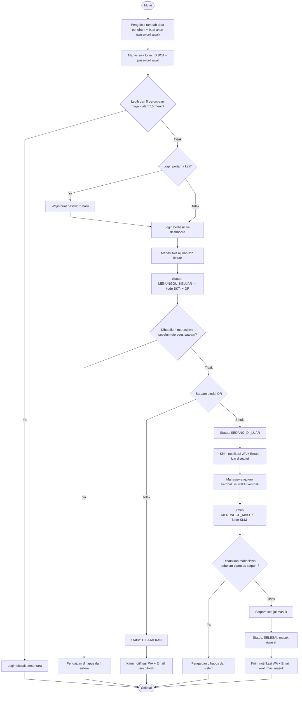

# SIKAT RTB

> Sistem Izin Keluar-Masuk Terintegrasi untuk penghuni Rumah Talenta BCA (RTB).

SIKAT RTB menggantikan pencatatan izin yang tersebar dengan satu alur digital: penghuni mengajukan izin, satpam memvalidasi di gerbang, dan pengelola memantau status secara langsung.

## 1. Tujuan proyek

### Masalah yang diselesaikan

- Pengajuan dan pencatatan keluar-masuk berpotensi lambat, tidak konsisten, dan sulit ditelusuri.
- Satpam perlu memeriksa identitas serta status izin dengan cepat di pos.
- Pengelola perlu mengetahui siapa yang berada di luar RTB.
- Identitas penghuni tidak boleh dibuat sembarang oleh pengguna yang tidak terdaftar.

### Hasil yang dituju

- Satu data status penghuni yang selalu mutakhir.
- Validasi keluar/masuk yang cepat lewat QR atau kode izin.
- Riwayat aktivitas yang dapat diaudit.
- Akses yang otomatis dibatasi berdasarkan peran akun.

## 2. Prinsip produk

1. **Role ditentukan sistem, bukan dipilih saat login.** Akun menentukan apakah seseorang melihat pengalaman mahasiswa, satpam, atau pengelola.
2. **Database adalah sumber kebenaran.** Excel hanya dipakai pengelola untuk merekap data awal dari mahasiswa; setelah data dimasukkan ke aplikasi, database SIKAT RTB menjadi master data.
3. **Akun dibuat oleh pengelola, bukan pendaftaran bebas.** Mahasiswa tidak bisa membuat akun sendiri; pengelola menambahkan data penghuni sekaligus akun login dengan password awal.
4. **Satpam memvalidasi pergerakan, bukan menyalin data.** QR/kode izin mengurangi input ulang dan antrean.
5. **Pengelola memantau pengecualian.** Fokus dashboard pengelola adalah mahasiswa di luar RTB, bukan dekorasi chart.

## 3. Peran dan hak akses

| Peran | Tujuan utama | Akses |
| --- | --- | --- |
| Mahasiswa/penghuni | Mengajukan dan melacak izin pribadi | Beranda, ajukan izin, QR izin aktif, riwayat sendiri, profil (bisa mengubah kamar/nomor WA/email sendiri) |
| Satpam | Memvalidasi status keluar/masuk secara cepat | Scanner/kode izin, konfirmasi keluar/masuk, daftar penghuni di luar, riwayat validasi gabungan seluruh satpam |
| Pengelola | Mengelola data master dan memantau kondisi RTB | Dashboard monitoring, riwayat validasi gabungan (sama seperti satpam), master penghuni & satpam, laporan, pengaturan |

> Semua pemeriksaan hak akses dilakukan di server. Menyembunyikan menu di frontend bukan mekanisme keamanan.

## 4. Alur end-to-end

Ringkasan siklus satu izin dari sisi mahasiswa. Untuk alur lengkap per peran (termasuk Satpam dan Pengelola) dan DFD, lihat **[docs/diagrams/](docs/diagrams/)**.



### 4.1 Setup data oleh pengelola

1. Pengelola memperoleh daftar data penghuni dari proses internal mereka (misalnya Excel hasil rekap).
2. Pengelola masuk ke **Master Penghuni** dan menambahkan data satu per satu (ID BCA, nama lengkap, nomor kamar, kelas/angkatan, jenis kelamin, password awal, nomor WA & email opsional), **atau** mengimpor banyak penghuni sekaligus lewat **Impor Excel** — unggah file `.xlsx` dengan kolom ID BCA/Nama Lengkap/Kamar/Kelas/Jenis Kelamin/Password Awal/Nomor WA/Email, tiap baris divalidasi dan disimpan independen sehingga baris yang tidak valid dilaporkan tanpa membatalkan baris lain yang valid. Mahasiswa dapat mengubah sendiri kamar/nomor WA/email miliknya kapan saja lewat halaman Profil setelah login — perubahan itu langsung tercermin di Master Penghuni.
3. Sistem membuat data penghuni sekaligus akun login mahasiswa dalam satu langkah, baik lewat form maupun impor. ID BCA divalidasi unik lintas seluruh akun (mahasiswa, satpam, pengelola) — bila sudah dipakai, sistem menolak dengan pesan "ID BCA ini sudah terdaftar, pakai ID BCA lainnya". Nomor kamar dibatasi maksimal 2 penghuni aktif; permintaan ketiga di kamar yang sama ditolak. Setiap penambahan/perubahan dicatat di audit log.
4. Mahasiswa dapat langsung login memakai ID BCA dan password awal tersebut.
5. Saat penghuni atau satpam sudah tidak lagi berada/bertugas di RTB, pengelola dapat **menonaktifkan** (mencabut akses login, riwayat tetap tersimpan), **menghapus satu per satu**, atau **menghapus satu kelas sekaligus** (dipakai saat pergantian angkatan) — ketiganya menghapus data, akun, dan riwayat izin terkait secara permanen, kecuali nonaktifkan yang hanya mencabut akses.
6. Setiap pergantian tahun ajaran, pengelola dapat mengekspor laporan riwayat penuh (halaman Laporan, periode "Semua waktu") sebagai arsip, lalu **Reset riwayat** (seluruh sistem atau per kelas) untuk mengosongkan riwayat izin lama tanpa menghapus akun/master data.

### 4.2 Login, ganti password wajib, dan reset mandiri

```text
Login pertama
→ mahasiswa masuk dengan ID BCA + password awal dari pengelola
→ sistem mendeteksi status wajib ganti password
→ mahasiswa membuat password baru
→ password tersimpan, sesi lanjut ke dashboard
```

- Password awal hanya untuk login pertama; setiap akun baru (mahasiswa, satpam, maupun pengelola) wajib menggantinya sebelum bisa memakai sistem.
- Lupa password? Mahasiswa dapat memverifikasi ulang ID BCA + nama lengkap + nomor kamar untuk mengatur password baru secara mandiri, tanpa melibatkan pengelola.
- Data tidak ditemukan atau tidak cocok saat verifikasi: permintaan reset ditolak, password lama tidak berubah.
- Satpam dan pengelola tidak memiliki reset password mandiri; perubahan akses mereka selalu melalui pengelola yang berwenang.

### 4.3 Pengajuan izin mahasiswa

1. Mahasiswa login dan membuka **Ajukan Izin**.
2. Mahasiswa mengisi tujuan, tanggal/waktu keluar, dan estimasi kembali.
3. Server membuat data izin, nomor izin unik, dan QR bertanda tangan/bertoken acak.
4. Mahasiswa melihat QR dan status `MENUNGGU_KELUAR`.
5. Mahasiswa menunjukkan QR tersebut kepada satpam saat keluar.

### 4.4 Validasi satpam

1. Satpam login; layar pertama langsung membuka **Validasi Cepat**.
2. Satpam memindai QR atau memasukkan kode izin.
3. Sistem menampilkan data yang relevan: nama, kamar, tujuan, estimasi kembali, dan status saat ini.
4. Bila statusnya `MENUNGGU_KELUAR`, satpam menekan **Catat keluar**.
5. Bila statusnya `SEDANG_DI_LUAR`, satpam menekan **Catat masuk**.
6. Server mencatat waktu aktual, ID satpam, dan perubahan status dalam event log.

QR yang tidak valid, kedaluwarsa, dibatalkan, atau dipakai pada status yang tidak sesuai harus ditolak.

### 4.5 Monitoring pengelola

- Dashboard menampilkan penghuni di dalam dan di luar, mahasiswa keluar hari ini, aktivitas hari ini, grafik aktivitas keluar-masuk, grafik jam sibuk keluar-masuk per jam, dan rekap SELURUH wing yang paling sering mengajukan izin. Grafik aktivitas dan jam sibuk masing-masing punya kalender "Dari–Ke" sendiri (default 7 hari & 30 hari terakhir) yang bisa diatur bebas; rekap wing memakai rentang yang sama dengan jam sibuk. Panel "Aktivitas terbaru" di bawahnya selalu tetap pada 24 jam terakhir (rolling window terpisah dari kalender), sementara kartu "Di luar RTB" tetap menghitung total riil tanpa batas waktu.
- Halaman **Riwayat** Pengelola bisa difilter per wing, kelas, dan jangka waktu (hari ini/7 hari/bulan ini/tahun ini/semua waktu). Halaman **Riwayat** Satpam menampilkan seluruh validasi keluar-masuk dari semua satpam tanpa filter (bukan cuma satpam yang login), lengkap dengan keterangan satpam mana yang memvalidasi tiap izin.
- Laporan bisa difilter berdasarkan kelas, periode (hari ini/7 hari/bulan ini/tahun ini/semua waktu), dan jenis data:
  aktivitas keluar-masuk, atau daftar penghuni yang sedang di dalam RTB saat ini. Kedua jenis data bisa diunduh sebagai CSV.

## 5. Siklus hidup izin

| Status | Makna | Pemicu perubahan |
| --- | --- | --- |
| `MENUNGGU_KELUAR` | Izin dibuat, penghuni belum melewati gerbang | Mahasiswa mengajukan izin |
| `SEDANG_DI_LUAR` | Satpam telah mencatat penghuni keluar | Satpam menekan Catat keluar |
| `SELESAI` | Penghuni telah tercatat masuk kembali | Satpam menekan Catat masuk |
| `DIBATALKAN` | Izin tidak berlaku lagi | Mahasiswa/pengelola membatalkan sesuai kebijakan |

## 6. Fitur, alasan, dan implementasi

| Fitur | Tujuan | Cara dibangun |
| --- | --- | --- |
| Master Penghuni & Master Satpam | Satu sumber data penghuni/satpam sekaligus akun login, dibuat, diubah, dinonaktifkan, atau dihapus permanen langsung oleh pengelola | CRUD penuh oleh pengelola; ID BCA unik lintas seluruh akun (pesan "ID BCA ini sudah terdaftar, pakai ID BCA lainnya" bila dobel); kelas dipilih dari daftar tetap (PPBP/PPTI); kamar wajib format `WING-NOMOR` (contoh `A1-101`) dan wing-nya harus cocok jenis kelamin penghuni (`lib/wings.ts`); satu kamar dibatasi maksimal 2 penghuni aktif; hapus permanen satu per satu atau sekelas sekaligus (beserta akun dan riwayat izinnya), terpisah dari nonaktifkan yang hanya mencabut akses; audit log |
| Wing & lantai | Merepresentasikan denah gedung asrama (ALG/AG/BG/A1/B1/A2/B2/A3/B3/A5) dan menegakkan pemisahan gender per lantai | Wing bukan kolom database — diturunkan dari awalan `room_number` lewat `wingFromRoom()`; setiap wing punya gender tetap, ditolak bila tidak cocok; dipakai di validasi kamar (tambah/edit/impor penghuni, edit kamar mandiri mahasiswa) dan rekap wing di dashboard pengelola |
| Impor Excel massal | Onboarding puluhan-ratusan penghuni tiap pergantian angkatan tanpa input satu per satu | Unggah `.xlsx` (kolom ID BCA/Nama/Kamar/Kelas/Jenis Kelamin/Password/Nomor WA), diparsing dengan `exceljs`, tiap baris divalidasi (termasuk format kamar & kecocokan wing) & disimpan independen (`importResidents`) sehingga baris tidak valid dilaporkan tanpa membatalkan baris lain |
| Reset riwayat keluar-masuk | Mengosongkan data izin lama setiap pergantian tahun ajaran tanpa menyentuh akun/master data | `resetHistory` di halaman Pengaturan pengelola, cakupan seluruh sistem atau per kelas; dianjurkan ekspor CSV "Semua waktu" sebagai arsip dulu sebelum reset, lihat §11a |
| Laporan tersaring | Pengelola bisa fokus ke kelas/periode/jenis data tertentu tanpa menyaring manual | Filter kelas, periode, dan jenis data (aktivitas keluar-masuk vs penghuni di dalam RTB) di `getReport`/`getResidentsInside`; unduhan CSV mengikuti filter yang sama |
| Notifikasi WA otomatis (opsional) | Mahasiswa tahu izinnya disetujui/ditolak atau ada pengumuman baru tanpa buka aplikasi terus-menerus | Kirim pesan template lewat WhatsApp Cloud API resmi (`lib/whatsapp.ts`) saat izin diputuskan satpam atau Pengelola broadcast; nonaktif kalau `WHATSAPP_CLOUD_API_TOKEN` belum di-set, lihat §10a |
| Notifikasi email otomatis (opsional) | Kanal Plan B yang independen dari WhatsApp untuk kejadian yang sama | Kirim email HTML lewat Resend (`lib/email.ts`) di titik pemicu yang sama seperti WA; nonaktif kalau `RESEND_API_KEY` belum di-set, lihat §10b |
| Edit kontak mandiri mahasiswa | Data kamar/WA/email tetap akurat tanpa menunggu Pengelola | Mahasiswa mengubah kamar, nomor WA, dan email miliknya sendiri dari halaman Profil (`updateOwnContactInfo`); menulis ke tabel yang sama dengan Master Penghuni Pengelola, jadi perubahan langsung terlihat di kedua sisi; nama, kelas, dan status penghuni tetap hanya bisa diubah Pengelola |
| Riwayat gabungan Satpam & Pengelola | Satu sumber kebenaran soal siapa memvalidasi apa, bisa dilihat shift satpam berikutnya maupun Pengelola | Halaman **Riwayat** menampilkan seluruh validasi keluar-masuk dari *semua* satpam (bukan cuma akun yang login), dengan keterangan satpam mana yang memutuskan tiap izin (`getPermitHistory`); versi Pengelola menambah filter wing/kelas/jangka waktu, versi Satpam tetap tanpa filter |
| Dashboard dengan rentang kalender bebas | Pengelola bisa membandingkan periode tertentu, bukan cuma jendela waktu tetap | Grafik aktivitas keluar-masuk & jam sibuk masing-masing punya input tanggal "Dari–Ke" independen (`app/manager/DashboardRangeFilter.tsx`, query param `actFrom/actTo` & `peakFrom/peakTo`), default 7 & 30 hari terakhir; rekap wing memakai rentang jam sibuk dan selalu menampilkan seluruh wing |
| Aktivitas terbaru 24 jam | Fokus pengelola pada pergerakan yang benar-benar baru saja terjadi, tanpa mencampur dengan kartu total di luar RTB | Panel di Dashboard menyaring event EXIT/ENTRY_REQUESTED terbaru per izin ke jendela bergulir 24 jam (`recentActivity` di `getManagerData`), terpisah dari kartu "Di luar RTB" yang tetap menghitung total riil tanpa batas waktu, dan terpisah dari antrean satpam yang tidak dibatasi waktu |
| Mode gelap/terang | Kenyamanan pemakaian pada kondisi pencahayaan berbeda, preferensi pengguna | Toggle 3-arah (Terang/Gelap/Ikuti sistem) di semua halaman, tersimpan di localStorage, tidak flash ke tema salah saat reload (`components/ThemeProvider.tsx`, `components/ThemeToggle.tsx`); palet gelap tetap memakai identitas navy+biru brand, bukan abu-abu generik |
| Login berbasis ID BCA | Satu identitas konsisten di seluruh alur | Credential auth, password hash bcrypt, cookie sesi `httpOnly` |
| RBAC | Memisahkan tampilan dan aksi tiap peran | `role` pada akun + middleware/guard server-side pada route dan action |
| Pengajuan izin | Menghilangkan input berulang dan memberi jejak digital | Form tervalidasi, nomor izin unik, tabel `permits` |
| QR izin | Mempercepat verifikasi di gerbang | Token acak per izin, QR generator, validasi token di server |
| Scan/kode manual | Tetap cepat saat kamera atau QR bermasalah | Web camera scanner dengan input kode sebagai fallback |
| Pencatatan keluar/masuk | Status penghuni selalu mutakhir | Transaksi database singkat yang membuat event dan memperbarui status izin |
| Riwayat & audit | Menjawab pertanyaan siapa melakukan apa dan kapan | Tabel event izin dan audit log yang append-only |

## 7. Arah UI/UX

Konsep desain: **Stempel Izin** — kertas hangat dan tinta navy, warna dipakai hemat sebagai aksen kecil (tag, status, garis), bukan sebagai permukaan besar. Logo dan kartu izin mengambil bentuk stempel/segel fisik: lingkaran ganda, motif gerbang, dan tanda tervalidasi.

- Latar `--color-paper` (kertas hangat) dan `--color-surface` (kartu) menggantikan biru-langit; teks utama `--color-ink`, blok struktural (sidebar, footer, hero) memakai `--color-navy` solid — tanpa gradien.
- Warna aksen (`--color-signal`, dan status semantik `--color-safe`/`--color-amber`/`--color-danger`) dipakai secukupnya: label kecil, dot status, tag — bukan mewarnai seluruh permukaan kartu.
- Tidak ada `backdrop-filter: blur` atau permukaan glass di mana pun. Kartu berbatas garis tipis (`--color-line`) di atas kertas polos.
- Tiket izin (landing, dashboard mahasiswa) memakai motif *stub* tiket sobek (`.stub-edge`) dan stempel segel (`components/Brand.tsx` → `BrandMark`) alih-alih kartu gradien mengambang.
- Radius kecil dan tegas (`--radius-panel` 10px, `--radius-card` 14px) dipakai terbatas; sebagian besar permukaan flat tanpa radius, hanya tag/status yang tetap pill.
- Motion dibatasi ke momen yang perlu saja: animasi masuk satu kali di splash (`app/loading.tsx`) dan hero landing, feedback fungsional (modal, tombol, spinner scan). Tidak ada animasi mengambang/orbit yang berulang terus-menerus.
- ID BCA, nomor izin, dan waktu memakai font monospace (Geist Mono) agar mudah dibaca di pos.
- Seluruh motion tunduk pada `prefers-reduced-motion`.
- Jangan gunakan foto orang hasil AI. Gunakan avatar inisial atau foto yang memang diunggah pengguna.

### Mode gelap

Toggle 3-arah (Terang / Gelap / Ikuti sistem) tersedia di landing page, halaman login, dan seluruh dashboard. Palet gelap bukan abu-abu generik — tetap memakai identitas navy + biru langit milik brand, hanya dibalik jadi permukaan navy gelap dengan aksen biru yang lebih terang supaya tetap menonjol. Implementasi: token warna `--color-*` didefinisikan ulang lewat `[data-theme="dark"]` dan `@media (prefers-color-scheme: dark)` di `app/globals.css`; pilihan pengguna tersimpan di localStorage lewat `ThemeProvider`, dan skrip inline di `app/layout.tsx` menerapkan tema sebelum halaman pertama kali digambar (tidak ada kedipan ke tema yang salah saat reload).

### Responsivitas berdasarkan konteks kerja

| Perangkat | Pengguna utama | Pola UI |
| --- | --- | --- |
| Ponsel (360–767px) | Mahasiswa | Bottom navigation, satu kolom, QR besar, form bertahap, tombol minimal 44px |
| Tablet (768–1023px) | Satpam | Scanner dominan, detail izin dan aksi validasi dalam satu layar |
| Desktop (>=1024px) | Pengelola | Sidebar/drawer, tabel terfilter, detail panel, laporan |

Aturan dasar:

- Ukuran teks isi minimal 14px; input minimal 16px agar browser mobile tidak melakukan zoom otomatis.
- Table di layar kecil diubah menjadi kartu/detail sheet, bukan dipaksa scroll horizontal.
- Grid memakai CSS Grid `minmax()` dan `clamp()`, bukan lebar kartu statis.
- Seluruh motion harus menghormati `prefers-reduced-motion`.

## 8. Stack teknis

| Area | Pilihan | Alasan |
| --- | --- | --- |
| Full-stack web | Next.js + TypeScript | Frontend, server action/API, dan route protection dalam satu aplikasi |
| Styling | Tailwind CSS v4 (CSS-first `@theme` tokens) + Geist/Geist Mono | Utility-first, tapi token warna/radius/motion tetap disentralkan lewat `app/globals.css` |
| Database | SQLite | Ringan, cukup untuk MVP satu service dengan jumlah pengguna kecil |
| Akses database | `better-sqlite3` + schema bootstrap | Sangat sederhana untuk satu service SQLite; schema dibuat idempotent ketika service mulai |
| Validasi data | Manual di tiap server action | Panjang, format (regex), dan kecocokan data dicek sebelum query dijalankan |
| Password | bcrypt (`bcryptjs`), cost factor 12 | Password tidak pernah disimpan dalam bentuk plaintext |
| Session | Stateless JWT (`jose`) + cookie `httpOnly` | Ditandatangani server, tidak disimpan di database; kedaluwarsa otomatis 8 jam |
| Rate limiting | Tabel `login_attempts` di SQLite | Maksimal 5 percobaan gagal per 15 menit per ID BCA, untuk login maupun reset password |
| Security header | `next.config.ts` `headers()` | CSP, `X-Frame-Options`, `Permissions-Policy` (kamera dibatasi ke situs sendiri), `Strict-Transport-Security` |
| QR | `qrcode` (SVG inline, server-side) + browser scanner | QR dirender lokal tanpa panggilan API pihak ketiga; mendukung scan kamera dan fallback kode manual |
| Notifikasi WA (opsional) | WhatsApp Business Platform (Cloud API resmi Meta) | Panggilan HTTP berbasis template per pesan, tanpa koneksi/sesi persisten di server — lihat §10a |
| Notifikasi email (opsional) | Resend (API HTTPS) | Jalur Plan B yang independen dari WhatsApp, tidak terhalang blokir SMTP hosting — lihat §10b |
| Impor Excel | `exceljs` | Parser `.xlsx` yang aktif dipelihara; sengaja bukan paket `xlsx` npm karena versi yang dipublikasikan di npm (0.18.5) punya CVE prototype-pollution/ReDoS yang belum ada perbaikannya di registry npm |
| Deployment | Railway | Satu service web dengan persistent volume untuk database |
| Testing | Vitest + Playwright | Menguji logic status/auth dan alur pengguna kritis |

### Struktur folder

```text
app/            Halaman & route Next.js (App Router) — folder ini menentukan URL,
                 tidak bisa dipindah/diganti nama bebas
  manager/       Halaman & komponen khusus Pengelola
  security/      Halaman & komponen khusus Satpam
  student/       Halaman & komponen khusus Mahasiswa
  api/           Endpoint API (notifikasi, laporan CSV, status izin)
components/     Komponen React yang dipakai lintas peran (shell, modal, tema, dll)
lib/            Logic murni: akses database, autentikasi, WhatsApp, email, dll
types/          Deklarasi TypeScript untuk paket tanpa tipe bawaan
public/         Aset statis (gambar, ikon)
scripts/        Skrip CLI: reset database, ekspor ke MySQL untuk cPanel
docs/           Dokumentasi project
  diagrams/      DFD dan flowchart per peran
  database/      Schema siap-pakai untuk migrasi database ke cPanel/MySQL
```

File konfigurasi di root (`next.config.ts`, `tsconfig.json`, `package.json`, dst) wajib tetap di root — dicari otomatis oleh Next.js/TypeScript/pnpm di lokasi itu.

## 9. Model data

10 tabel — schema lengkap siap-pakai (versi MySQL untuk migrasi cPanel) ada di [docs/database/schema.sql](docs/database/schema.sql).

```text
master_residents
  id, bca_id (unique), full_name, room_number, class_name, gender,
  resident_status, phone_number (nullable), email (nullable),
  created_at, updated_at
  — kamar/WA/email bisa diubah mahasiswa sendiri; sisanya hanya Pengelola
  — room_number wajib format WING-NOMOR (contoh A1-101); wing bukan
    kolom sendiri, diturunkan dari awalan room_number lewat lib/wings.ts
    dan wajib cocok dengan gender (lihat §9a)

accounts
  id, resident_id (nullable untuk satpam/pengelola), bca_id (unique),
  full_name, role (STUDENT/SECURITY/MANAGER), password_hash,
  is_active, must_change_password, created_at

security_staff
  id, bca_id (unique), full_name, gender, staff_status,
  created_at, updated_at

permits
  id, resident_id, permit_code (unique), qr_token (unique),
  destination, permit_type, planned_departure_at, planned_return_at,
  entry_code (nullable), status, created_at

permit_events
  id, permit_id, event_type (EXIT/ENTRY/EXIT_REJECTED/dst),
  performed_by_account_id, occurred_at
  — append-only, tidak boleh ditimpa; riwayat "siapa memvalidasi apa"

audit_logs
  id, actor_account_id, action, entity_type, entity_id, created_at

login_attempts
  id, identifier (ID BCA), action, attempted_at
  — dipakai rate limiting, tidak pernah ditampilkan ke UI manapun

manager_bootstrap_links
  bootstrap_bca_id (PK), account_id (unique)
  — hanya dipakai sekali saat setup akun Pengelola pertama

broadcast_notifications
  id, title, body, created_by_account_id, created_at

notification_deliveries
  notification_id + account_id (PK gabungan), read_at (nullable)
  — status baca notifikasi in-app per akun
```

Relasi FK: `accounts.resident_id → master_residents.id`, `permits.resident_id → master_residents.id`, `permit_events.permit_id → permits.id`, `permit_events.performed_by_account_id → accounts.id`, `manager_bootstrap_links.account_id → accounts.id`, `broadcast_notifications.created_by_account_id → accounts.id`, `notification_deliveries.notification_id → broadcast_notifications.id`, `notification_deliveries.account_id → accounts.id`.

DFD lengkap yang menggambarkan aliran data antar tabel ini ada di [docs/diagrams/dfd.md](docs/diagrams/dfd.md).

### 9a. Wing & lantai

Wing bukan kolom database — diturunkan dari awalan `room_number` (format wajib `WING-NOMOR`, contoh `A1-101`), dan setiap wing punya jenis kelamin tetap yang wajib cocok dengan `master_residents.gender`. Ditegakkan oleh `lib/wings.ts`, dipakai di validasi tambah/edit/impor penghuni (Pengelola) maupun edit kamar mandiri (Mahasiswa), dan jadi dasar rekap wing di Dashboard Pengelola.

| Wing | Lantai | Jenis kelamin |
| --- | --- | --- |
| ALG | Lantai ALG | Perempuan |
| AG | Lantai AG | Perempuan |
| BG | Lantai BG | Laki-laki |
| A1 | Lantai 1 | Perempuan |
| B1 | Lantai 1 | Perempuan |
| A2 | Lantai 2 | Perempuan |
| B2 | Lantai 2 | Perempuan |
| A3 | Lantai 3 | Laki-laki |
| B3 | Lantai 3 | Laki-laki |
| A5 | Lantai 5 | Laki-laki |

## 10. Keamanan minimum

- Password di-hash memakai bcrypt; tidak pernah disimpan di Excel atau database sebagai plaintext.
- Sesi berupa JWT bertanda tangan (`jose`, HS256) di cookie `httpOnly`, `secure` di production, `sameSite=lax`, kedaluwarsa 8 jam. `SESSION_SECRET` wajib diisi — server menolak menyala tanpanya.
- Rate limit pada login dan reset password: maksimal 5 percobaan gagal per 15 menit untuk ID BCA yang sama (tabel `login_attempts`), lalu percobaan berikutnya ditolak sampai jendela waktu itu berakhir.
- Error login tidak membocorkan apakah sebuah ID BCA ada atau tidak.
- Validasi role dan kepemilikan izin dilakukan di server.
- Token QR bersifat acak, tidak berisi data pribadi dalam plaintext, dan hanya valid untuk izin/status yang sesuai.
- Catat aksi sensitif: perubahan master penghuni, pembuatan akun staf, pembatalan izin, dan validasi gerbang.
- Security header aktif di semua route (`next.config.ts`): `Content-Security-Policy`, `X-Frame-Options: DENY`, `X-Content-Type-Options: nosniff`, `Referrer-Policy`, `Strict-Transport-Security`, dan `Permissions-Policy` yang membatasi kamera hanya untuk situs sendiri (dipakai scanner QR satpam) serta menolak mikrofon/lokasi/pembayaran/USB.

> Verifikasi ID BCA + nama + kamar pada reset password mandiri cukup untuk prototype, tetapi bukan bukti identitas yang kuat jika data tersebut mudah diketahui orang lain. Untuk penggunaan nyata, tambahkan OTP ke kanal resmi sebelum password baru diterima.

## 10a. Notifikasi WhatsApp (opsional)

Mahasiswa dapat menerima pesan WA otomatis saat izin keluar/masuknya disetujui **atau ditolak** satpam, dan saat
Pengelola mengirim broadcast baru. Fitur ini **nonaktif secara default** (`WHATSAPP_CLOUD_API_TOKEN` belum di-set)
dan tidak memengaruhi fitur lain jika tidak diaktifkan.

> **Status saat ini (15 Agustus 2026):** pendaftaran akun WhatsApp Business Platform resmi sedang berjalan; nomor
> yang direncanakan sempat kena pembatasan pengiriman sementara (bukan blokir permanen) akibat pemakaian gateway
> tidak resmi sebelumnya, jadi pendaftaran dilanjutkan setelah pembatasannya reda. Kredensial belum tersedia,
> sehingga fitur ini masih nonaktif di production sampai keempat template di bawah disetujui Meta.

**Cara kerja teknis:** pesan dikirim lewat **WhatsApp Business Platform (Cloud API)** resmi dari Meta — satu
panggilan HTTP POST per pesan ke Graph API (`lib/whatsapp.ts`), tanpa koneksi atau sesi persisten di server ini.
Karena ini jalur resmi, pesan proaktif (di luar jendela obrolan yang dimulai pengguna) **wajib** memakai template
yang sudah disetujui Meta — tidak bisa teks bebas.

> Sistem ini sempat mencoba dua jalur gratis tanpa API resmi: `@whiskeysockets/baileys` (menyambung langsung lewat
> protokol WhatsApp Web) dan Fonnte (gateway pihak ketiga yang memakai teknik serupa dari sisi server mereka).
> Keduanya menyebabkan nomor yang dipakai kena pembatasan dari WhatsApp — percobaan pertama karena pairing
> berulang dalam waktu singkat, percobaan kedua kemungkinan karena kombinasi nomor baru tanpa riwayat pemakaian
> dan siklus sambung-putus device yang berulang. Cloud API resmi dipilih sebagai jalur akhir karena satu-satunya
> yang benar-benar bebas dari risiko pembatasan itu — bukan sekadar memasang aplikasi WhatsApp Business di HP,
> yang tetap tunduk pada aturan anti-spam yang sama seperti akun WhatsApp biasa.

**Empat template yang perlu dibuat dan disetujui di WhatsApp Manager** (kategori **Utility**, bahasa Indonesia):

| Nama template | Isi (baris `{{n}}` adalah variabel) |
| --- | --- |
| `sikat_izin_keluar_disetujui` | Yth. `{{1}}`,\n\nPengajuan izin keluar Anda telah disetujui oleh petugas keamanan RTB.\n\nKode Izin: `{{2}}`\nKeterangan: `{{3}}`\nWaktu Keluar: `{{4}}`\n\nMohon melapor kembali melalui aplikasi SIKAT RTB setelah Anda tiba kembali di RTB.\n\nTerima kasih.\n— Sistem SIKAT RTB |
| `sikat_izin_keluar_ditolak` | Yth. `{{1}}`,\n\nMohon maaf, pengajuan izin keluar Anda ditolak oleh petugas keamanan RTB di gerbang.\n\nKode Izin: `{{2}}`\nKeterangan: `{{3}}`\n\nAnda tetap tercatat berada di dalam RTB. Untuk informasi lebih lanjut, silakan menghubungi petugas keamanan secara langsung.\n\nTerima kasih.\n— Sistem SIKAT RTB |
| `sikat_konfirmasi_masuk` | Yth. `{{1}}`,\n\nAnda telah tercatat kembali masuk ke RTB, dikonfirmasi oleh petugas keamanan.\n\nKode Konfirmasi: `{{2}}`\nWaktu Masuk: `{{3}}`\n\nTerima kasih telah melapor tepat waktu melalui aplikasi SIKAT RTB.\n— Sistem SIKAT RTB |
| `sikat_notifikasi_baru` | Yth. `{{1}}`,\n\nTerdapat notifikasi terbaru dari Pengelola RTB di aplikasi SIKAT RTB:\n\n`{{2}}`\n\nMohon segera membuka aplikasi SIKAT RTB untuk memeriksa informasi lengkapnya.\n\nTerima kasih.\n— Sistem SIKAT RTB |

**Batasan yang perlu disadari:**

- Approval template oleh Meta tidak instan — bisa dari beberapa menit sampai sekitar 24 jam.
- Nomor pengirim yang didaftarkan ke Cloud API **tidak bisa dipakai bersamaan** di aplikasi WhatsApp/WhatsApp
  Business biasa; sebaiknya pakai nomor khusus yang belum pernah dipakai WhatsApp sama sekali.
- Mahasiswa perlu mengisi nomor WA di Master Penghuni (kolom opsional) supaya bisa menerima notifikasi; yang belum
  mengisi nomor otomatis dilewati, tidak menyebabkan error.
- Ada kuota gratis bulanan dari Meta untuk percakapan kategori utility; di luar kuota itu berbayar (biasanya masih
  murah untuk skala satu RTB).
- Nomor yang sebelumnya pernah kena pembatasan pengiriman oleh WhatsApp (misalnya bekas dipakai gateway tidak
  resmi) sebaiknya menunggu masa pembatasannya selesai dan berhenti dipakai lewat gateway itu sama sekali, sebelum
  didaftarkan ke Cloud API — reputasi pembatasan menempel ke nomornya, bukan ke aplikasi pengirimnya.

**Cara mengaktifkan:**

1. Buat/masuk ke Meta Business Account di [business.facebook.com](https://business.facebook.com), lalu buat App
   bertipe Business di [developers.facebook.com](https://developers.facebook.com) dan tambahkan produk WhatsApp.
2. Selesaikan **Business Verification** (Business Settings → Security Center) dengan dokumen identitas/usaha —
   proses ini yang biasanya paling lama, dari beberapa jam sampai beberapa hari.
3. Daftarkan nomor bisnis di WhatsApp → API Setup → Add phone number, lalu verifikasi lewat OTP SMS/panggilan ke
   nomor tersebut.
4. Di WhatsApp Manager, buat keempat template pada tabel di atas persis sesuai teksnya dengan kategori **Utility**,
   kirim untuk direview.
5. Setelah nomor dan template disetujui, catat **Phone Number ID** dan **Access Token** (token permanen lewat
   System User untuk production, bukan token sementara 24 jam).
6. Set `WHATSAPP_CLOUD_API_TOKEN=<access token>` dan `WHATSAPP_PHONE_NUMBER_ID=<phone number id>` sebagai
   environment variable (lokal: `.env.local`; production: pengaturan Railway) — jangan pernah commit nilai ini ke
   git — lalu deploy ulang. Notifikasi otomatis aktif begitu keempat template berstatus disetujui dan variabelnya
   terbaca; sebelum disetujui, panggilan API akan gagal dengan pesan error dari Meta yang tercatat di log, tanpa
   mengganggu proses lain.

## 10b. Notifikasi email (Plan B)

Jalur notifikasi kedua, independen dari WhatsApp — dipilih sebagai **Plan B** karena tidak perlu proses verifikasi
bisnis atau approval template seperti Cloud API, jadi bisa aktif jauh lebih cepat sambil pendaftaran WhatsApp masih
berjalan. Mahasiswa menerima email otomatis untuk kejadian yang sama seperti WhatsApp: izin keluar disetujui/ditolak,
konfirmasi masuk, dan broadcast baru dari Pengelola.

**Cara kerja teknis:** dikirim lewat **[Resend](https://resend.com)** (`lib/email.ts`), API pengiriman email berbasis
HTTPS — bukan SMTP mentah. Ini pilihan yang disengaja: Railway (dan kebanyakan platform hosting lain) membatasi
koneksi SMTP keluar secara default untuk mencegah spam, jadi SMTP biasa (dicoba lebih dulu, termasuk lewat Gmail)
gagal terus dengan error jaringan (`ENETUNREACH`, lalu `Connection timeout`) meski kredensialnya benar. HTTPS tidak
pernah diblokir platform manapun karena itu jalur yang sama dipakai untuk memuat halaman web biasa. Nonaktif secara
default; aktif otomatis begitu `RESEND_API_KEY` ter-set.

**Cara mengaktifkan:**

1. Daftar akun gratis di [resend.com](https://resend.com) (gratis sampai 3.000 email/bulan).
2. **Verifikasi domain** di Resend (Domains → Add Domain), ikuti instruksi menambah beberapa DNS record (TXT/MX) di
   pengaturan domain kamu. Tanpa domain terverifikasi, Resend hanya izinkan kirim ke alamat email akun Resend kamu
   sendiri — tidak cukup untuk kirim ke email penghuni yang sesungguhnya. Kalau belum punya domain, ini satu-satunya
   langkah yang butuh domain (beli domain murah, atau tanya apakah kampus/RTB punya domain yang bisa dipakai
   sub-domainnya, misalnya `rtb.namakampus.ac.id`).
3. Buat API key (API Keys → Create API Key).
4. Set environment variable — lokal: `.env.local`; production: pengaturan Railway — jangan pernah commit nilai ini
   ke git:
   - `RESEND_API_KEY` — API key dari langkah 3
   - `RESEND_FROM` — opsional, contoh `SIKAT RTB <notifikasi@domainkamu.com>` (pakai domain yang sudah diverifikasi);
     kalau kosong, default memakai `onboarding@resend.dev` (hanya untuk testing, bukan production)
5. Deploy ulang. Mahasiswa perlu mengisi email di Master Penghuni (kolom opsional, sama seperti Nomor WA) supaya
   bisa menerima notifikasi; yang belum mengisi email otomatis dilewati, tidak menyebabkan error.
6. Set `EMAIL_DEBUG=true` sementara untuk melihat ID pengiriman di log server saat menguji, sebelum mengandalkannya
   penuh di production.

## 11. Setup lokal

### Prasyarat

- Node.js LTS
- npm atau pnpm
- Git

### Environment variable

Buat `.env.local` dari `.env.example`:

```env
DATABASE_URL=file:./data/sikat.db
SESSION_SECRET=ganti-dengan-random-string-panjang
APP_URL=http://localhost:3000

# Opsional, hanya untuk pembuatan akun manager pertama kali:
INITIAL_MANAGER_BCA_ID=
INITIAL_MANAGER_PASSWORD=
INITIAL_MANAGER_NAME=
```

Variabel notifikasi WhatsApp (§10a) dan email (§10b) opsional — lihat `.env.example` untuk daftar lengkapnya.

### Perintah yang akan digunakan

```bash
pnpm install
pnpm db:reset # opsional: hapus database lokal
pnpm dev
```

Server lokal akan tersedia di `http://localhost:3000`.

### Akun Pengelola awal

Database dimulai kosong — tidak ada data fiktif/seed. Gunakan `INITIAL_MANAGERS` di `.env.local` atau variabel environment platform deployment untuk membuat satu atau beberapa akun Pengelola pada startup pertama. Nilainya berupa JSON array satu baris, misalnya:

```env
INITIAL_MANAGERS=[{"bcaId":"033245","name":"Nama Pengelola","password":"password-awal-minimal-8-karakter"}]
```

Setiap Pengelola bootstrap wajib mengganti password pada login pertama. Proses ini idempotent: akun Pengelola yang sudah ada tidak akan ditimpa atau di-reset ketika aplikasi redeploy. Variabel lama `INITIAL_MANAGER_BCA_ID`, `INITIAL_MANAGER_PASSWORD`, dan `INITIAL_MANAGER_NAME` masih didukung untuk satu akun demi kompatibilitas.

## 11a. Reset riwayat tahunan

Setiap pergantian tahun ajaran, jumlah baris `permits`/`permit_events` bisa menumpuk tanpa pernah dibersihkan. Pengelola dapat mengosongkannya lewat halaman **Pengaturan** → **Reset riwayat**, dengan dua cakupan:

- **Seluruh sistem** — menghapus semua `permits`, `permit_events`, `notification_deliveries`, dan `broadcast_notifications`.
- **Kelas tertentu** — hanya menghapus izin & event milik penghuni di kelas itu; notifikasi broadcast (bersifat untuk seluruh akun, bukan per kelas) tidak ikut terhapus.

Akun, Master Penghuni/Satpam, dan audit log **tidak pernah** ikut terhapus oleh fitur ini. Karena tindakan ini permanen, urutan yang dianjurkan:

1. Buka halaman **Laporan**, pilih periode **"Semua waktu"**, unduh CSV sebagai arsip tahunan (opsional: per kelas).
2. Baru jalankan **Reset riwayat** dengan cakupan yang sesuai.

Skrip CLI `pnpm db:reset-history` (`scripts/reset-history.ts`) melakukan hal yang sama untuk seluruh sistem dan tetap tersedia untuk reset database lokal saat pengembangan; skrip ini membaca `DATABASE_URL` sehingga menjalankannya dari komputer lokal **tidak akan** memengaruhi database production di Railway — gunakan fitur di halaman Pengaturan (atau `railway run pnpm db:reset-history` untuk cakupan seluruh sistem) saat menyasar production.

## 12. Deployment Railway

### Arsitektur

```text
GitHub repository
        │
        ▼
Railway Web Service (1 replica)
        │
        └── Persistent Volume mounted at /data
                └── sikat.db
```

### Konfigurasi

1. Hubungkan repository ke satu Railway Web Service.
2. Tambahkan Volume dan mount pada `/data`.
3. Atur variable production:

```env
DATABASE_URL=file:/data/sikat.db
SESSION_SECRET=<random-secret-production>
APP_URL=https://<domain-production>
NODE_ENV=production
INITIAL_MANAGERS=<JSON-array-akun-pengelola-awal>
```

4. Schema database dibuat idempotent ketika aplikasi mulai, karena Railway memasang volume saat runtime, bukan saat build.
5. Jalankan service dalam **satu replica** selama database memakai SQLite.
6. Aktifkan backup volume dan lakukan backup sebelum perubahan schema/import data besar.

Railway menyatakan file service di luar volume bersifat ephemeral sehingga tidak bertahan setelah deployment; database harus disimpan di volume. Lihat [Railway Volumes](https://docs.railway.com/volumes) dan [Railway Services](https://docs.railway.com/services).

### Batas SQLite

SQLite cocok pada tahap ini karena operasinya singkat dan jumlah pengguna sedikit. SQLite mengizinkan satu writer dalam satu waktu; aktifkan WAL dan jangan scale service menjadi beberapa replica yang menulis file database yang sama. Jika kebutuhan berkembang menjadi banyak gerbang/perangkat yang menulis bersamaan, high availability, atau beberapa replica, migrasikan database ke PostgreSQL. Lihat [panduan penggunaan SQLite](https://www.sqlite.org/whentouse.html) dan [WAL mode](https://www.sqlite.org/wal.html).

## 13. Tahapan pembangunan

### Fase 1 — Fondasi

- Inisialisasi Next.js, TypeScript, styling, linting, dan schema SQLite idempotent.
- Schema master penghuni, akun, sesi, izin, dan event.
- Seed data fiktif serta guard role server-side.

### Fase 2 — Identitas dan data master

- Login, logout, pembuatan akun mahasiswa oleh pengelola, dan reset password mandiri.
- CRUD Master Penghuni untuk pengelola.
- Audit log perubahan data master.

### Fase 3 — Izin dan gerbang

- Form izin mahasiswa, QR, detail izin, dan riwayat.
- Scanner/kode manual satpam.
- Transisi status keluar/masuk yang atomik.

### Fase 4 — Monitoring dan kualitas

- Dashboard pengelola, filter, dan laporan.
- Pengujian auth, role, transisi izin, dan responsivitas.
- Accessibility pass, backup, deployment Railway, dan demo script.

## 14. Kriteria selesai MVP

- Pengelola dapat menambah penghuni ke Master Penghuni.
- Pengelola membuat akun mahasiswa dan satpam dengan password awal; seluruh akun mengganti password pada login pertama.
- Mahasiswa hanya dapat melihat izin miliknya sendiri.
- Satpam dapat memvalidasi QR/kode keluar dan masuk.
- Pengelola dapat melihat daftar penghuni di luar.
- Seluruh validasi meninggalkan event/audit trail.
- Data tetap ada setelah redeploy Railway.
- Tampilan nyaman pada ponsel mahasiswa, tablet satpam, dan desktop pengelola.

## 15. Di luar scope MVP

- Integrasi langsung dengan sistem ID BCA/Oracle.
- OTP email/SMS atau SSO.

Fitur-fitur tersebut dapat ditambahkan setelah alur inti stabil dan kebutuhan operasional RTB dikonfirmasi.
