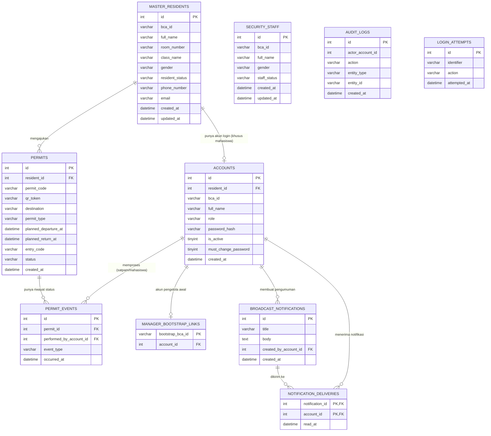

# 3.3 Skema Relasi Database (Entity-Relationship / Relationship Window)

Diagram di bawah ini digambar dengan Mermaid (`erDiagram`), mirip tampilan "Relationship Window" di MySQL Workbench atau tab "Designer" di phpMyAdmin. Setiap kotak adalah satu tabel, garis menunjukkan relasi antar tabel lewat foreign key.

Versi visual yang lebih rapi juga dipublikasikan sebagai Artifact (link diberikan terpisah di chat) — isinya sama persis, hanya lebih enak dilihat/discreenshot untuk ditempel ke proposal.

## Catatan tentang tabel yang tidak terhubung langsung

- `SECURITY_STAFF` adalah data induk petugas satpam, tapi **tidak** dihubungkan dengan foreign key ke `ACCOUNTS`. Akun login satpam tetap dibuat di tabel `ACCOUNTS` (dengan `role = 'SECURITY'`), sedangkan datanya dicocokkan lewat `bca_id` yang sama di level aplikasi, bukan lewat relasi database. Pola ini sama dengan `MASTER_RESIDENTS`, hanya saja untuk mahasiswa relasinya sudah dibuat formal lewat `accounts.resident_id`.
- `AUDIT_LOGS` dan `LOGIN_ATTEMPTS` adalah tabel log/pencatatan aktivitas sistem (siapa melakukan apa, percobaan login gagal untuk mencegah brute-force). Keduanya berdiri sendiri, tidak diberi foreign key ke tabel lain, karena fungsinya hanya sebagai catatan historis, bukan bagian dari alur transaksi utama.
