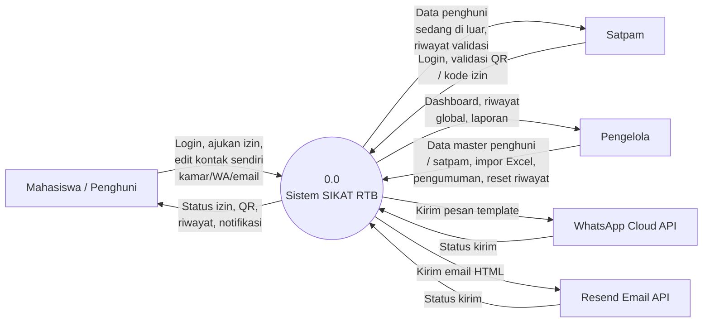

# DFD SIKAT RTB

Diturunkan langsung dari schema database ([lib/db.ts](../../lib/db.ts)) dan alur server action ([app/actions.ts](../../app/actions.ts)) yang berjalan saat ini — termasuk notifikasi WhatsApp + Email, riwayat global Pengelola, dan edit kontak mandiri oleh mahasiswa.

## DFD Level 0 (Diagram Konteks)

Sistem sebagai satu proses tunggal dan pertukaran data dengan pihak luar.



## DFD Level 1

Memecah proses tunggal menjadi lima proses utama dan seluruh tabel data yang dipakai.

```mermaid
flowchart TD
  MHS[Mahasiswa]
  SAT[Satpam]
  PGL[Pengelola]
  WA[WhatsApp Cloud API]
  EMAIL[Resend Email API]

  P1((1.0
  Manajemen
  Data Master))
  P2((2.0
  Autentikasi
  & Akun))
  P3((3.0
  Pengajuan &
  Validasi Izin))
  P4((4.0
  Notifikasi))
  P5((5.0
  Monitoring &
  Pelaporan))

  D1[(D1 master_residents
  wing diturunkan dari
  awalan nomor kamar)]
  D2[(D2 accounts)]
  D3[(D3 security_staff)]
  D4[(D4 permits)]
  D5[(D5 permit_events)]
  D6[(D6 login_attempts)]
  D7[(D7 broadcast_notifications)]
  D8[(D8 notification_deliveries)]
  D9[(D9 audit_logs)]

  PGL -->|Tambah/edit/hapus penghuni
  & satpam, impor Excel| P1
  MHS -->|Edit kamar, WA,
  email milik sendiri| P1
  P1 --> D1
  P1 --> D3
  P1 -->|Buat akun awal| D2
  P1 --> D9

  MHS -->|ID BCA + password,
  ganti/reset password| P2
  SAT -->|ID BCA + password| P2
  PGL -->|ID BCA + password| P2
  P2 --> D6
  P2 -.->|Cek & update kredensial| D2
  P2 -->|Sesi login| MHS
  P2 -->|Sesi login| SAT
  P2 -->|Sesi login| PGL

  MHS -->|Ajukan izin, konfirmasi
  waktu kembali, batalkan| P3
  SAT -->|Validasi keluar
  / masuk| P3
  P3 --> D4
  P3 --> D5
  P3 -.->|Cek data penghuni| D1
  P3 -->|Status & QR izin| MHS
  P3 -->|Data penghuni di luar| SAT

  P3 -->|Trigger: status berubah| P4
  PGL -->|Buat pengumuman
  broadcast| P4
  P4 --> D7
  P4 --> D8
  P4 -->|Kirim pesan template| WA
  WA -->|Status kirim| P4
  P4 -->|Kirim email HTML| EMAIL
  EMAIL -->|Status kirim| P4
  P4 -->|Notifikasi diterima| MHS

  D1 -.-> P5
  D4 -.-> P5
  D5 -.-> P5
  D9 -.-> P5
  P5 -->|Dashboard: grafik aktivitas
  & jam sibuk (rentang kalender
  diatur bebas), rekap SELURUH
  wing, aktivitas 24 jam terakhir,
  riwayat keluar-masuk (filter
  wing/kelas/jangka waktu),
  laporan + CSV| PGL
  P5 -->|Riwayat global
  keluar-masuk| SAT
```

> Catatan: `manager_bootstrap_links` tidak digambarkan — hanya dipakai sekali saat setup akun Pengelola pertama, bukan bagian dari alur data operasional harian.

## Perubahan sejak versi sebelumnya

- **Proses 1.0** sekarang ditulis oleh dua aktor: Pengelola (data lengkap) *dan* Mahasiswa (kamar/WA/email milik sendiri saja) — sebelumnya hanya Pengelola.
- **Proses 1.0** juga memvalidasi wing: setiap penyimpanan kamar (tambah/edit/impor Pengelola, maupun edit kamar mandiri Mahasiswa) mengecek awalan nomor kamar terhadap tabel wing di [lib/wings.ts](../../lib/wings.ts) dan menolak jika jenis kelamin tidak cocok dengan wing tersebut. Wing bukan kolom tersendiri di `master_residents`, hanya diturunkan dari `room_number`.
- **Proses 4.0** sekarang mengirim ke dua kanal eksternal: WhatsApp Cloud API *dan* Resend Email API (sebelumnya cuma WhatsApp).
- **Proses 5.0** outputnya juga mengalir ke Satpam — sejak halaman Riwayat pengelola dan satpam sama-sama menampilkan riwayat validasi gabungan seluruh satpam (bukan hanya milik akun yang login).
- **Proses 5.0** (Dashboard Pengelola) kini menghasilkan dua analitik baru selain grafik aktivitas: grafik jam sibuk keluar-masuk (per jam) dan rekap wing yang paling sering mengajukan izin (SELURUH wing selalu ditampilkan, bukan cuma top-N). Kedua grafik dan rekap wing punya rentang tanggal yang bisa diatur bebas lewat kalender (default 7 hari untuk aktivitas, 30 hari untuk jam sibuk/rekap wing) — bukan lagi jendela waktu tetap.
- **Proses 5.0** juga menambah panel "Aktivitas terbaru" yang selalu dibatasi 24 jam terakhir (rolling window, bukan kalender), terpisah dari kartu "Di luar RTB" yang tetap menghitung total riil tanpa batas waktu.
- **Proses 5.0** (Riwayat Pengelola) sekarang bisa difilter per wing, kelas, dan jangka waktu (Hari ini/7 hari/Bulan ini/Tahun ini/Semua waktu) — Riwayat Satpam tetap tanpa filter seperti sebelumnya, mengambil dari fungsi data yang sama (`getPermitHistory`) tanpa argumen.
