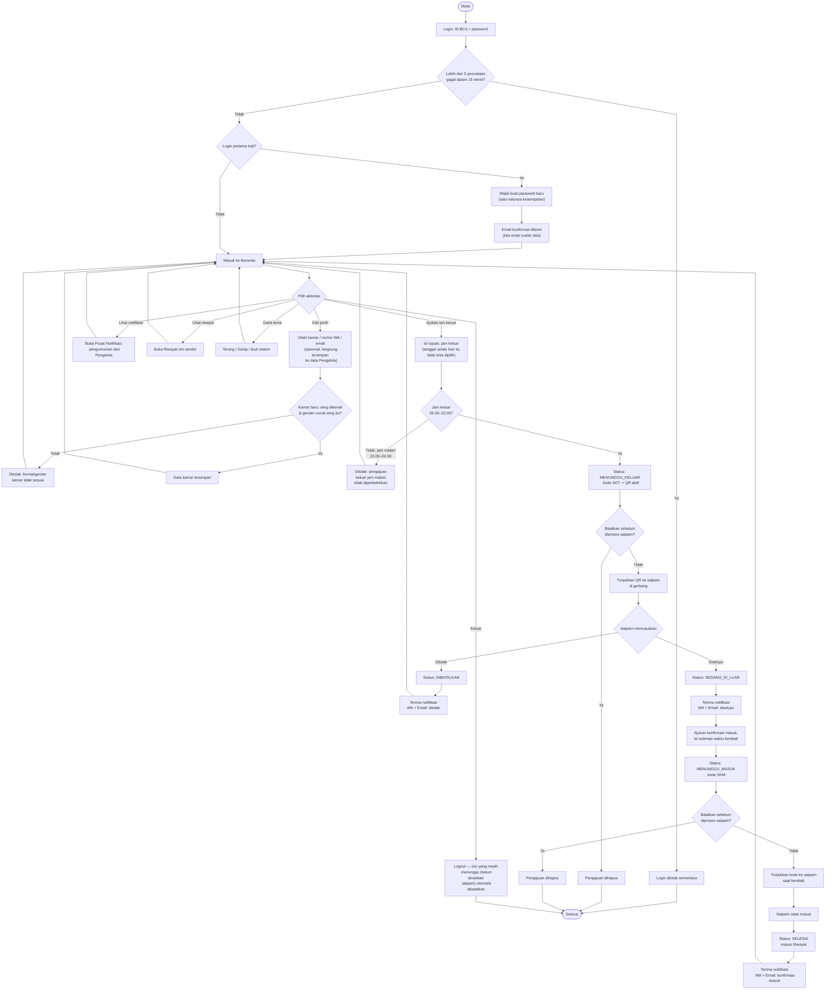

# Flowchart — Mahasiswa

Alur dari sudut pandang penghuni: login, ajukan izin, sampai kembali ke RTB. Sumber: [app/student/](../../app/student/), [app/actions.ts](../../app/actions.ts).

**Catatan:**
- Satu izin **masuk** tidak bisa ditolak satpam (hanya dikonfirmasi) — beda dengan izin **keluar** yang bisa ditolak.
- Notifikasi WA dan Email dikirim otomatis di titik yang sama, tapi masing-masing independen: kalau salah satu kanal belum diaktifkan Pengelola (belum ada kredensial), kanal lain tetap jalan.
- Edit kamar/WA/email bisa dilakukan kapan saja dari halaman Profil, tidak menunggu proses izin selesai.
- Kamar wajib format `WING-NOMOR` (contoh `A1-101`) dan wing-nya harus cocok dengan jenis kelamin mahasiswa — lihat tabel wing di [flowchart-pengelola.md](flowchart-pengelola.md#referensi-wing).
- **Password hanya bisa diganti sekali**, saat login pertama (langkah "Wajib buat password baru" di atas). Setelah itu, mahasiswa tidak bisa mengganti password sendiri lagi, dan **tidak ada jalur reset mandiri** — kalau lupa, satu-satunya cara adalah menghubungi Pengelola RTB untuk direset. Sistem mengirim email konfirmasi (`sendPasswordChangedEmail`) begitu password baru itu tersimpan, kalau email di Master Penghuni sudah diisi — jaga-jaga supaya ada catatan yang bisa dicek ulang kalau lupa.
- **Logout membatalkan izin yang masih menunggu validasi satpam** (`MENUNGGU_KELUAR`/`MENUNGGU_MASUK`) — QR/kode tidak lagi punya batas waktu akhir sejak berputar tiap 15 detik (lihat di bawah), jadi logout jadi titik pembersihan alaminya. Login berikutnya selalu mulai dari **Ajukan Izin** baru. Tidak berlaku untuk status `SEDANG_DI_LUAR`, yang tetap dipertahankan karena itu status nyata mahasiswa di dunia fisik.
- **QR/kode izin berputar tiap 15 detik**, bukan nilai tetap sejak dibuat — turunan HMAC dari secret per izin (`qr_token`) + jendela waktu saat itu (`currentPermitCode` di `lib/db.ts`), mirip TOTP. Halaman mahasiswa polling `/api/student/current-permit-code` tiap 15 detik supaya QR/kode yang tampil selalu yang berlaku, tanpa perlu isi ulang form. Screenshot lama, kode yang ditulis di kertas, atau kode yang dibagikan ke orang lain berhenti berfungsi maksimal ~30 detik kemudian (toleransi ±1 jendela) — terlepas dari izinnya sudah diproses satpam atau belum.
- **QR tidak bisa dibuat screenshot-proof 100% dari sisi visual** — itu di luar kendali halaman web mana pun (screenshot/screen-recording terjadi di level OS, bukan lewat browser). Yang benar-benar diterapkan (`components/PermitQr.tsx`): klik-kanan/tekan-lama "simpan gambar" dinonaktifkan, dan QR di-blur otomatis saat tab/aplikasi tidak aktif (agar tidak nampak di thumbnail app-switcher). Perlindungan sebenarnya ya rotasi 15 detik di atas.
- Validasi satpam **tidak akan pernah menandai QR di luar sistem sebagai valid** — `getPermitForSecurity` menghitung ulang kode yang seharusnya berlaku *saat itu juga* (turunan HMAC dari `qr_token`, toleransi ±1 jendela 15 detik) dan mencocokkannya persis, bukan membandingkan ke `permit_code`/`entry_code` yang tersimpan tetap di database; kode apa pun yang tidak cocok, tidak valid, di luar jendela waktu yang berlaku, atau sudah pernah dipakai selalu tampil pesan generik "Terjadi kesalahan".
- Label `permit_code`/`entry_code` (dipakai di laporan/riwayat, bukan lagi yang divalidasi satpam — lihat poin rotasi QR di atas) dibuat lewat `crypto.getRandomValues()` (alfabet 32 karakter tanpa karakter ambigu), bukan `Math.random()` — sama seperti `qr_token` yang memakai `crypto.randomUUID()` sebagai secret rotasi.
- **Tanggal izin keluar/masuk selalu hari ini** — field tanggal di form hanya tampilan, tidak bisa diedit ke kemarin atau besok. `createPermitAction` menghitung tanggalnya sendiri di server (zona Jakarta), bukan memercayai nilai dari form, jadi tidak bisa dimanipulasi lewat request langsung; yang tetap bisa mahasiswa pilih hanya jam-nya.
- **Jam malam (22.00–04.59): pengajuan izin keluar ditolak** — hanya berlaku untuk waktu keluar, bukan waktu kembali. Ditegakkan di `createPermit` (`lib/db.ts`), bukan cuma `min`/`max` di form.
- **Login juga dibatasi per alamat IP** (`LOGIN_IP`), terpisah dari batas per ID BCA — supaya satu sumber yang mencoba banyak ID BCA berbeda (password spraying) tetap tertahan. Batasnya 5/30 menit (lihat README §10 untuk tradeoff-nya di WiFi bersama satu gedung asrama).
