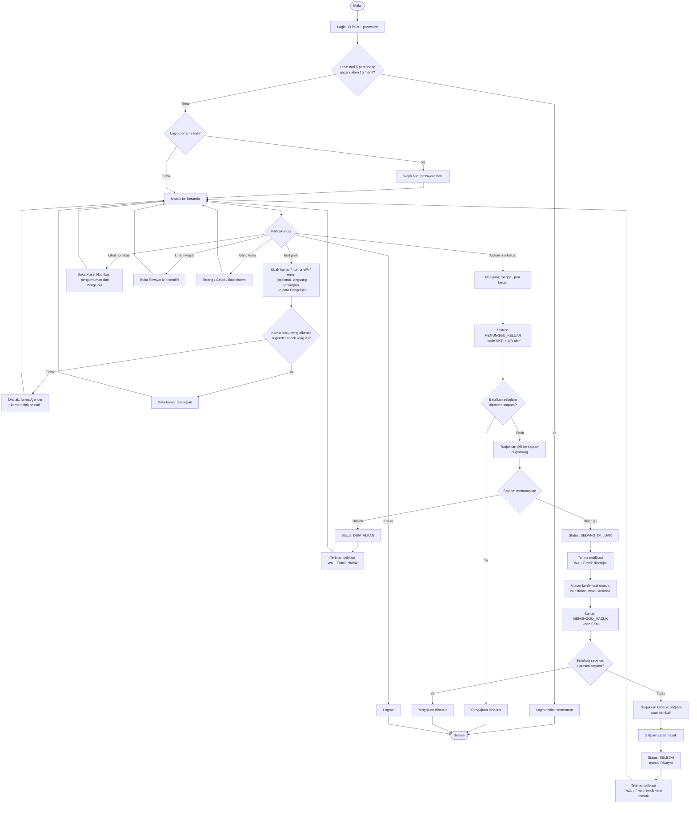

# Flowchart — Mahasiswa

Alur dari sudut pandang penghuni: login, ajukan izin, sampai kembali ke RTB. Sumber: [app/student/](../../app/student/), [app/actions.ts](../../app/actions.ts).

**Catatan:**
- Satu izin **masuk** tidak bisa ditolak satpam (hanya dikonfirmasi) — beda dengan izin **keluar** yang bisa ditolak.
- Notifikasi WA dan Email dikirim otomatis di titik yang sama, tapi masing-masing independen: kalau salah satu kanal belum diaktifkan Pengelola (belum ada kredensial), kanal lain tetap jalan.
- Edit kamar/WA/email bisa dilakukan kapan saja dari halaman Profil, tidak menunggu proses izin selesai.
- Kamar wajib format `WING-NOMOR` (contoh `A1-101`) dan wing-nya harus cocok dengan jenis kelamin mahasiswa — lihat tabel wing di [flowchart-pengelola.md](flowchart-pengelola.md#referensi-wing).
- **Password hanya bisa diganti sekali**, saat login pertama (langkah "Wajib buat password baru" di atas). Setelah itu, mahasiswa tidak bisa mengganti password sendiri lagi — kalau lupa, gunakan **Reset Password** mandiri di halaman login (verifikasi ID BCA + nama + kamar), bukan menu ganti password.
- **QR tidak bisa di-screenshot 100%** — itu di luar kendali halaman web mana pun (screenshot/screen-recording terjadi di level OS, bukan lewat browser). Yang benar-benar diterapkan (`components/PermitQr.tsx`): klik-kanan/tekan-lama "simpan gambar" dinonaktifkan, dan QR di-blur otomatis saat tab/aplikasi tidak aktif (agar tidak nampak di thumbnail app-switcher). Perlindungan sebenarnya tetap di server: QR/kode izin sekali pakai (`decidePermit`) — begitu divalidasi satpam, salinan apa pun (termasuk screenshot lama) langsung tidak berlaku.
- Validasi satpam **tidak akan pernah menandai QR di luar sistem sebagai valid** — `getPermitForSecurity` mencocokkan kode yang dipindai persis (`=`, bukan pencarian sebagian) terhadap `permit_code`/`qr_token`/`entry_code` yang tersimpan; kode apa pun yang tidak cocok selalu tampil "Izin tidak ditemukan".
- Kode `SKT-`/`SKM-` dibuat lewat `crypto.getRandomValues()` (alfabet 32 karakter tanpa karakter ambigu), bukan `Math.random()` — sama seperti `qr_token` yang sudah lebih dulu memakai `crypto.randomUUID()`.
