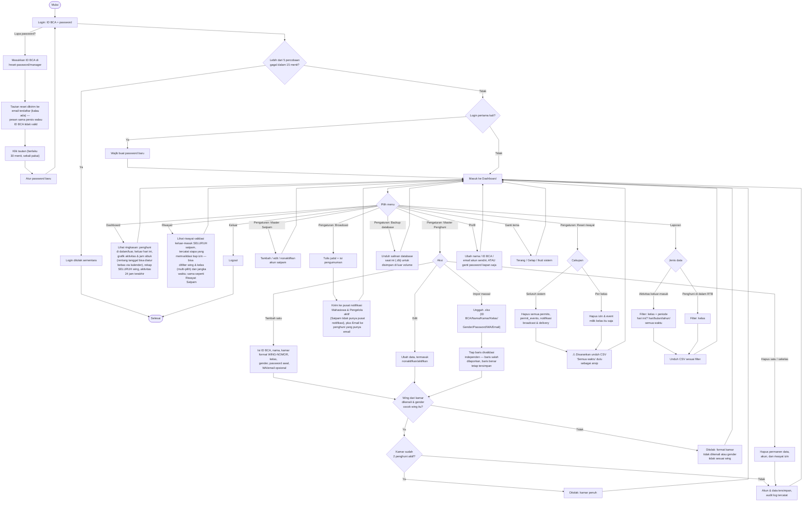

# Flowchart — Pengelola

Alur dari sudut pandang pengelola RTB: kelola data master, pantau kondisi RTB, dan kirim pengumuman. Sumber: [app/manager/](../../app/manager/), [app/actions.ts](../../app/actions.ts).

**Catatan:**
- Menu **Riwayat** ini fitur baru — sebelumnya hanya satpam yang punya halaman ini; sekarang Pengelola juga bisa melihat data yang persis sama untuk pemantauan.
- **Broadcast** memicu dua hal sekaligus: notifikasi in-app ke akun Mahasiswa & Pengelola (Satpam tidak punya pusat notifikasi — ikonnya tidak ditampilkan di shell Satpam), dan email ke penghuni yang sudah mengisi alamat email.
- Nama, kelas, dan status penghuni **tetap** hanya bisa diubah lewat menu ini (bukan oleh mahasiswa sendiri); yang boleh diubah mahasiswa sendiri hanya kamar, WA, dan email.
- **Wing** bukan kolom database tersendiri — sistem menurunkannya dari awalan nomor kamar (format `WING-NOMOR`, contoh `A1-101`), lalu mengecek jenis kelamin penghuni harus cocok dengan wing tersebut. Aturan ini berlaku di tambah/edit/impor Pengelola *maupun* saat mahasiswa mengubah kamar sendiri di halaman Profil.
- Grafik **Aktivitas keluar-masuk**, **Jam sibuk**, dan **Rekap wing** di Dashboard masing-masing punya kalender "Dari – Ke" independen sendiri-sendiri (default 7 hari, 30 hari, 30 hari) — mengubah satu tidak memengaruhi yang lain. Panel **Aktivitas terbaru** di Dashboard selalu tetap pada 24 jam terakhir (tidak ikut kalender) — kartu "Di luar RTB" di atasnya tetap menghitung total riil termasuk yang sudah di luar lebih dari 24 jam.
- Filter **Riwayat** (wing & kelas, masing-masing bisa multi-pilih, plus jangka waktu) sekarang identik di halaman Pengelola *dan* Satpam — satu komponen (`components/PermitHistoryPage.tsx`) dipakai keduanya.
- **Password Pengelola bisa diganti kapan saja** dari halaman Profil (`ManagerChangePasswordForm`) — beda dengan Mahasiswa/Satpam yang cuma boleh sekali, saat login pertama. Ditegakkan di `changePasswordAction` (server), bukan cuma disembunyikan di UI: percobaan ganti password dari akun Mahasiswa/Satpam di luar momen login pertama akan ditolak walau dikirim langsung ke server.
- **Reset password Pengelola lewat email** (`requestManagerPasswordReset`/`resetManagerPasswordWithToken`) butuh email sudah diisi di Profil lebih dulu. Token acak (256-bit), di-hash sebelum disimpan (`password_reset_tokens.token_hash`), sekali pakai, kedaluwarsa 30 menit. Pesan yang ditampilkan sama persis baik ID BCA itu Pengelola sungguhan, Pengelola tanpa email, atau ID BCA yang tidak ada — supaya tidak bisa dipakai menebak akun mana yang valid.
- **Backup database**: otomatis harian di volume yang sama (dipicu tiap Dashboard dimuat, disimpan 14 hari) melindungi dari korupsi/salah hapus; tombol **Unduh backup** di Pengaturan untuk salinan manual yang disimpan di luar volume — dua-duanya perlu, beda risiko yang dijaga. Detail di README §11c.
- Kode izin manual (`SKT-`/`SKM-`, dipakai satpam saat scan QR gagal) dibuat lewat `crypto.getRandomValues()` dengan alfabet 32 karakter tanpa karakter ambigu — bukan `Math.random()`. Pencarian kode/QR di halaman Validasi Satpam kena rate limit 20 percobaan "tidak ditemukan" per 15 menit per akun satpam (`SCAN`), terpisah dari rate limit login/reset password.

## Referensi wing

| Wing | Lantai | Jenis kelamin |
| --- | --- | --- |
| ALG | Lantai ALG | Perempuan |
| AG | Lantai AG | Perempuan |
| BG | Lantai BG | Laki-laki |
| A1 | Lantai 1 | Perempuan |
| B1 | Lantai 1 | Perempuan |
| A2 | Lantai 2 | Perempuan |
| B2 | Lantai 2 | Perempuan |
| A3 | Lantai 3 | Laki-laki |
| B3 | Lantai 3 | Laki-laki |
| A5 | Lantai 5 | Laki-laki |

Sumber kebenaran: [lib/wings.ts](../../lib/wings.ts).
