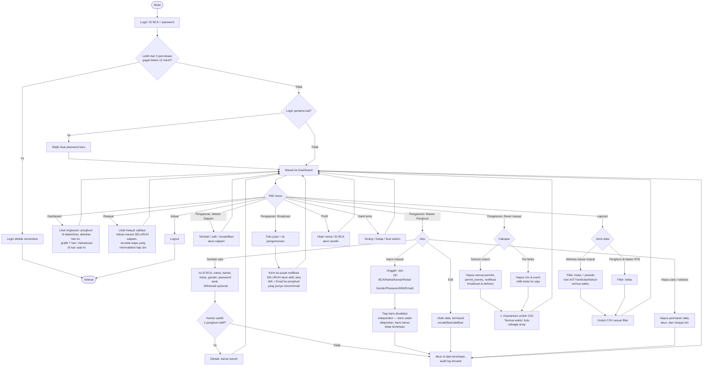

# Flowchart — Pengelola

Alur dari sudut pandang pengelola RTB: kelola data master, pantau kondisi RTB, dan kirim pengumuman. Sumber: [app/manager/](../../app/manager/), [app/actions.ts](../../app/actions.ts).

**Catatan:**
- Menu **Riwayat** ini fitur baru — sebelumnya hanya satpam yang punya halaman ini; sekarang Pengelola juga bisa melihat data yang persis sama untuk pemantauan.
- **Broadcast** memicu tiga hal sekaligus: notifikasi in-app ke semua akun, pesan WhatsApp, dan email — dua yang terakhir hanya ke penghuni yang sudah mengisi nomor WA/email.
- Nama, kelas, dan status penghuni **tetap** hanya bisa diubah lewat menu ini (bukan oleh mahasiswa sendiri); yang boleh diubah mahasiswa sendiri hanya kamar, WA, dan email.
