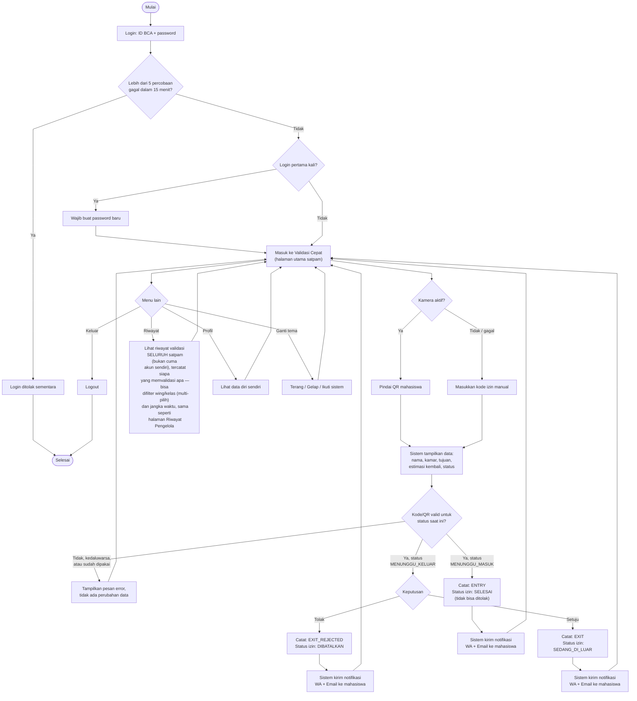

# Flowchart — Satpam

Alur dari sudut pandang petugas keamanan di gerbang. Sumber: [app/security/](../../app/security/), [app/actions.ts](../../app/actions.ts).

**Catatan:**
- Setiap keputusan (setuju/tolak/konfirmasi masuk) dicatat sebagai *event* dengan `performed_by_account_id` — jadi identitas satpam yang memutuskan selalu tersimpan, dan muncul di halaman Riwayat sebagai "oleh [nama satpam]".
- Halaman **Riwayat** menampilkan aktivitas dari *semua* satpam yang pernah bertugas, bukan cuma yang sedang login — supaya satpam shift berikutnya bisa lihat kelanjutan kasus dari shift sebelumnya.
- Halaman **Riwayat** Satpam dan Pengelola sekarang memakai komponen yang sama persis (`components/PermitHistoryPage.tsx`): filter wing dan kelas bisa multi-pilih (checkbox, bukan satu per satu), filter jangka waktu (Hari ini/7 hari/Bulan ini/Tahun ini/Semua waktu), dan tanpa filter berarti "semua". Hanya rute (`/security/outside` vs `/manager/history`) dan label peran yang beda.
- **Password hanya bisa diganti sekali**, saat login pertama (langkah "Wajib buat password baru" di atas). Satpam tidak punya reset password mandiri (beda dengan mahasiswa) — kalau lupa, hubungi Pengelola RTB untuk direset.
- Langkah **Valid?** di atas mencocokkan kode/QR yang dipindai persis (`=`, bukan pencarian sebagian) terhadap `permit_code`/`qr_token`/`entry_code` di database (`getPermitForSecurity`). QR atau kode apa pun yang bukan dari SIKAT RTB — atau kode asli yang sudah dipakai/kedaluwarsa — selalu jatuh ke jalur "Izin tidak ditemukan", tidak pernah tertulis valid.
